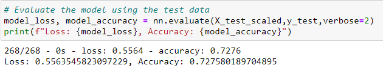
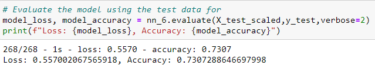

# Neural_Network_Charity_Analysis

## Resources
Python 3.7.9, Scikit-Learn 0.24.1, Tensorflow 2.4.1

## Overview

The purpose of this project was to use build a neural network deep learning model to predict if organizations would likely receive their requested donations from a particular non-profit.  I used a dataset containing metadata about organizations that had previously requested donations, including whether or not their requests were granted.  The goal was to create a model with at least 75% accuracy.

I then preprocessed the data by dropping columns, grouping some unique values in 'Other' bins for certain columns to reduce noisy data, used OneHotEncoder to transform categorical variables into numerical data, divided the variable columns into features and target, split the data into training and testing sets, and finally scaled the features data using StandardScaler.

I then built a Neural Network Deep Learning Model.  After testing the model and determining the initial model structure did not achieve the desired accuracy, I tweaked the model multiple times in attempt to improve the accuracy.  I saved the weight coefficients for each version of the model, and for the model with the highest accuracy I saved the entire model.

## Reults

- Data Preprocessing

    - The target variable was the 'IS_SUCCESSFUL' column from the original data set, as the goal of the model was to predict if organizations would be successful in procuring funding.

    - The features variables were APPLICATION_TYPE, AFFILIATION, CLASSIFICATION, USE_CASE, ORGANIZATION, STATUS, INCOME_AMT, and ASK_AMT
    
    - The columns EIN and NAME were dropped from the data set rather than including them in the features as they are identifiers of the organizaitions that do not add insight into whether their request will be successful.  The SPECIAL_CONSIDERATIONS column was also dropped in an attempt to reduce noise in the data set after testing the initial model.

- Compiling, Training, and Evaluating the Model

    - I used 120 neurons for the two hidden layers of the model, as that was roughly 3 times the number of features.  I used two hidden layers and one output layer as one layer would likely not be sufficient in achieving an accurate model, and three layers proved no more effective than two layers while tweaking the model and took longer to fit.  I used the Relu activation function for the hidden layers because there were no negative values in the input data, and I used the Sigmoid activation function for the output layer to achieve a binary classification result.

    - The initial model had an accuracy of 72.76 %.  
    
    
    
    After attempting five times to optimize I was unable to achieve the desired 75 % accuracy.  The final version of the model tested achieved an accuracy of 73.07 %.

    

    - 